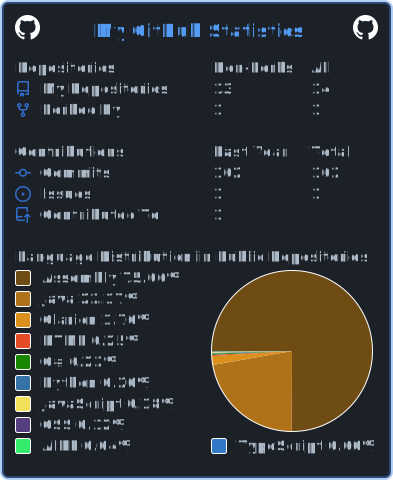

# Hey! 

My main interest is web development. I lean towards the frontend, but ultimately aim for a comprehensive understanding of the web.

  You can visit my portfolio at <strong><a href="http://linic.net">linic.net</a></strong> (currently down).

Listed in the table below are the parts of my tech stack I use, learn, and love:

| Languages | Libraries | Frameworks | Databases |
| --------- | --------- | ---------- | --------- |
|  |  |  |  |
|  |  |  |  |
|  |  |  |  |

<!--
|  |  |  |  |
-->

Other: C++, Prisma

My programming-related channel (work in progress) and other social media:

 ‎ ‎ ‎  ‎ ‎ ‎ 

<h4><a href="https://drive.google.com/file/d/15ffZXAg4IqIg1fzHCM4SEfwhwbkx_hsq/view?usp=sharing"> Click here</a> for my resume!</h4>

<!--

-->
