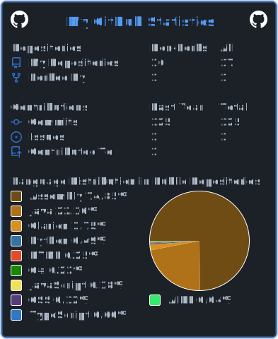

# Hey! 

Listed below are the parts of my tech stack I use, learn, and love:

| Languages | Libraries | Frameworks | Databases |
| --------- | --------- | ---------- | --------- |
|  |  |  |  |
|  |  |  |  |

My main interests are frontend web development and machine learning. I will likely also get to know backend quite well at some point.

My YT channel (work in progress):

   ___      ___   

### [Click here](https://drive.google.com/file/d/15ffZXAg4IqIg1fzHCM4SEfwhwbkx_hsq/view?usp=sharing) for my resume!

<!--

-->
